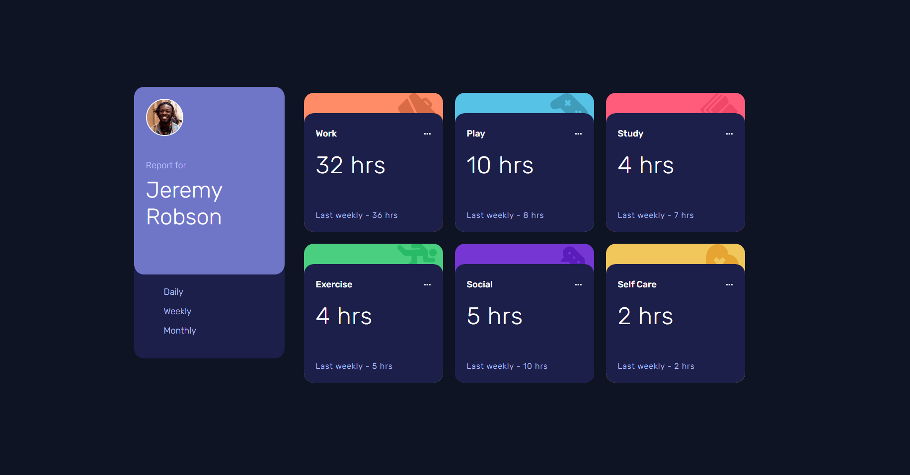

# Frontend Mentor - Time tracking dashboard

This is a solution to the [Four card feature section challenge on Frontend Mentor](https://www.frontendmentor.io/challenges/four-card-feature-section-weK1eFYK). Frontend Mentor challenges help you improve your coding skills by building realistic projects. 

## Table of contents

- [Overview](#overview)
  - [The challenge](#the-challenge)
  - [Screenshot](#screenshot)
  - [Links](#links)
- [My process](#my-process)
  - [Built with](#built-with)
- [Author](#author)

**Note: Delete this note and update the table of contents based on what sections you keep.**

## Overview

### The challenge

Users should be able to:

- View the optimal layout for the site depending on their device's screen size

### Screenshot

screenshot, feel free to remove this entire section.**

### Links

- Solution URL: [Add solution URL here](https://github.com/LizunYuri/time-tracking-dashboard)
- Live Site URL: [Add live site URL here](https://lizunyuri.github.io/time-tracking-dashboard/)

## My process

### Built with

- Semantic HTML5 markup
- CSS custom properties
- Flexbox
- CSS Grid
- Mobile-first workflow

## Author

- Website - [b_Root](https://www.build-root.ru)
- Frontend Mentor - [@LizunYuri](https://www.frontendmentor.io/profile/LizunYuri)